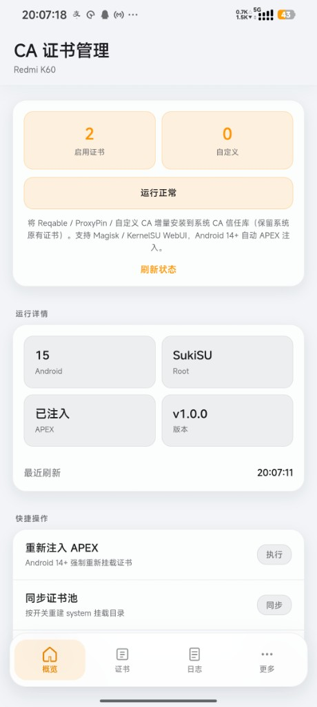
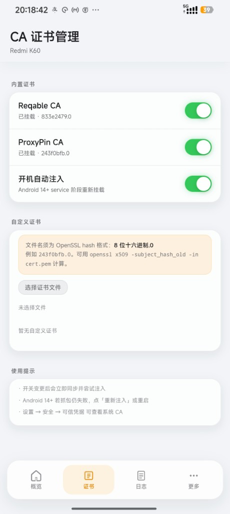
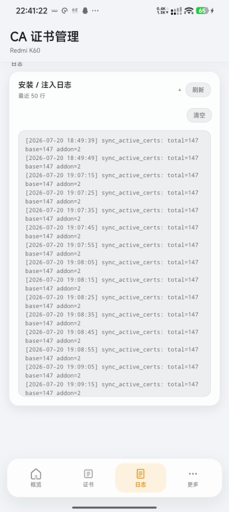
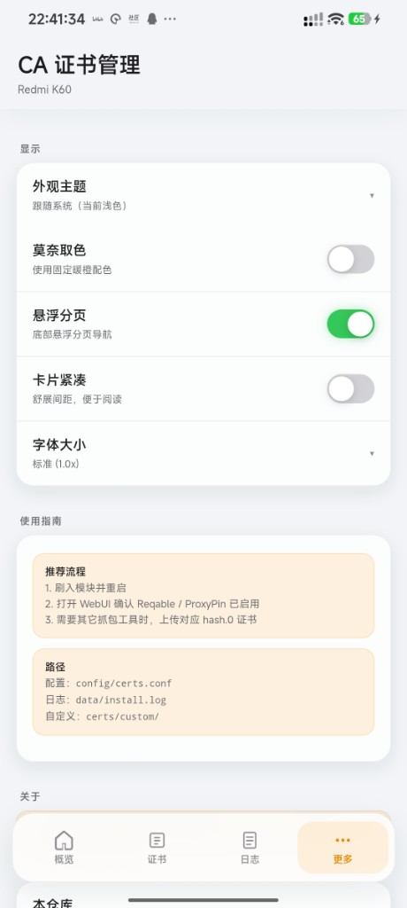

# 证书桥（CertBridge）

将 **Reqable** / **ProxyPin** / 自定义 CA 合并进 Android **系统信任库**的 Magisk 模块，支持 KernelSU 等管理器 WebUI。Android 14+ 自动 APEX Conscrypt 注入。提供 **完整版**（内置 OpenSSL）与 **Lite**（约 8KB dex）双包。

- **仓库**：[Eikeitsu/CertBridge](https://github.com/Eikeitsu/CertBridge)
- **文档**：[eikeitsu.github.io/CertBridge](https://eikeitsu.github.io/CertBridge/)
- **酷安**：[许小墨](https://www.coolapk.com/u/7602666)
- **模块显示名**：证书桥
- **模块 ID**：`CertBridge`

## WebUI 预览

|                        概览                         |                       证书                       |
| :-------------------------------------------------: | :----------------------------------------------: |
|  |  |

|                      日志                      |                      更多                       |
| :--------------------------------------------: | :---------------------------------------------: |
|  |  |

## 功能概览

- 默认安装自动检测 App CA；也可用音量键逐项自定义  
- Reqable / ProxyPin 优先从已安装 App 导入；ProxyPin 可内置兜底；**不内置 Reqable**  
- 仅 HttpCanary、ADGuard 在安装时可能询问导入为自定义；也可上传 PEM / DER  
- Android 7–16；Android 14+ APEX + system 双路径  
- 每次开机从实时系统信任库**完整合并**，不保存系统 CA 基线  
- 可选用户凭据区 / 存储卡证书免重启热挂载（合并永久 addon），可按会话无痕卸载  
- 可选 WebUI：状态、证书管理与详情、日志；主题 / 莫奈 / 布局等  
- 生成或校验失败时不挂载，保留系统原始证书库  

## 快速开始

1. 从 [Releases](https://github.com/Eikeitsu/CertBridge/releases) 下载 `CertBridge_v*.zip`（完整版）或 `*_lite.zip`  
2. 刷入模块，音量上默认安装，或音量下自定义  
3. 重启；若安装了 WebUI，打开页面确认状态  

详细说明见 [在线文档](https://eikeitsu.github.io/CertBridge/) 或 `docs/`。

## 仓库结构

```text
module/          # Magisk 模块本体
  webroot/       # WebUI 源码
docs/            # VitePress 用户文档
  public/screenshots/
tooling/         # 构建脚本
.github/         # CI
```

## 本地开发

```bash
npm install
npm run dev:web
npm run build:module          # 默认同时打完整版 + Lite
npm run build:cbx509          # 仅构建 Lite 用 dex
npm run dev:docs
```

构建说明见 [`tooling/BUILD.md`](tooling/BUILD.md)。  
`PACKAGE_EDITIONS=full|lite|both`，`OPENSSL_ABIS=arm,arm64|all`。

发版：Actions → **Release Module** → Run workflow，或推送 `v*` 标签。

## 相关软件

- [Reqable](https://reqable.com)
- [ProxyPin](https://github.com/wanghongenpin/proxypin)

## License

MIT
