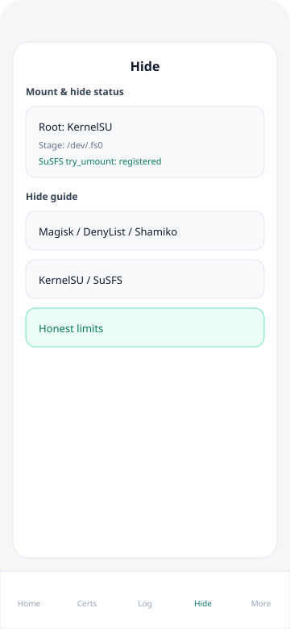

# 证书桥（CertBridge）

面向 Magisk / KernelSU / APatch 的 **系统 CA 注入**：把 Reqable / ProxyPin / 自定义证书合并进 Android 系统信任库，并提供挂载隐藏协助、可选 Zygisk 过滤与 WebUI。

- **显示名 / ID**：证书桥 · `CertBridge`
- **仓库**：[Eikeitsu/CertBridge](https://github.com/Eikeitsu/CertBridge)
- **文档**：[eikeitsu.github.io/CertBridge](https://eikeitsu.github.io/CertBridge/)
- **Releases**：[完整版 / Lite 下载](https://github.com/Eikeitsu/CertBridge/releases)
- **酷安**：[许小墨](https://www.coolapk.com/u/7602666)

## WebUI 预览

|                        首页                         |                       证书                       |
| :-------------------------------------------------: | :----------------------------------------------: |
|  |  |

|                      日志                      |                      隐藏                       |                      更多                       |
| :--------------------------------------------: | :---------------------------------------------: | :---------------------------------------------: |
|  |  |  |

## 功能概览

- **系统 CA 注入**：每次开机从实时信任库完整合并 + addon，校验通过后 bind；失败则不挂载，保留系统原库（不保存基线、不改系统分区）
- **证书来源**：Reqable / ProxyPin 从 App 同步（**不内置 Reqable**；ProxyPin 可内置兜底）；HttpCanary / ADGuard 安装时可询问导入；WebUI 上传 PEM / DER
- **挂载模式**：默认完整兼容（运行时 bind，不依赖元模块）；自定义可选轻量 Magic；Android 14+ 默认痕迹较少（主 APEX）
- **挂载隐藏（可选）**：默认安装含 SuSFS / 内核 try_umount 协助（开关默认关）；自定义可选 Zygisk 过滤 mountinfo
- **热挂载（可选）**：用户凭据区 / 存储卡证书免重启临时注入，可按会话卸载
- **WebUI / CLI**：首页 · 证书 · 日志 · 隐藏 · 更多；`bin/cb`（`status` / `set` / `sync_apps` …）

抓包前请勿对 Reqable、被抓包 App 开「卸载模块」，否则会出现「根证书未安装」或断网。说明见 [挂载隐藏](docs/guide/hide.md)、[常见问题](docs/guide/faq.md)。

## 快速开始

1. 从 [Releases](https://github.com/Eikeitsu/CertBridge/releases) 下载 `CertBridge_v*.zip`（推荐）或 `*_lite.zip`
2. 刷入：音量上 **默认安装**（WebUI + 热挂载 + 隐藏协助默认关）；音量下 **自定义**（可含 Zygisk 过滤、挂载模式等）
3. **重启**后打开 WebUI 或执行 `bin/cb status --live` 确认状态

包说明、组件选项与升级见 [安装与升级](docs/guide/install.md)。完整指南见 [在线文档](https://eikeitsu.github.io/CertBridge/) 或 [`docs/`](docs/)。

## 仓库结构

```text
module/     # Magisk 模块本体（脚本、证书、可选 webroot / zygisk）
webui/      # WebUI 源码（React）
native/     # Zygisk 挂载过滤源码（可选构建）
docs/       # VitePress 用户文档 → GitHub Pages
archives/   # 历史原生 WebUI 归档（不打包）
tooling/    # 构建与发版脚本
.github/    # CI
```

## 本地开发

```bash
npm install
npm run dev:web
npm run build:module          # 默认完整版 + Lite
npm run build:cbx509          # 仅 Lite 用 dex
npm run dev:docs
```

- 构建：[`tooling/BUILD.md`](tooling/BUILD.md)
- 发版与 changelog：[`tooling/RELEASE.md`](tooling/RELEASE.md)（开发写根目录 `changelog.md` → `## Unreleased`）
- 环境变量：`PACKAGE_EDITIONS=full|lite|both`，`OPENSSL_ABIS=arm,arm64|all`

发版：Actions → **Release Module** → Run workflow，或推送 `v*` 标签。

## 相关软件

- [Reqable](https://reqable.com)
- [ProxyPin](https://github.com/wanghongenpin/proxypin)

导入方式、HttpCanary / ADGuard 等见 [相关软件](docs/guide/related.md)。维护者说明见 [致谢](docs/guide/credits.md)。

## License

MIT
